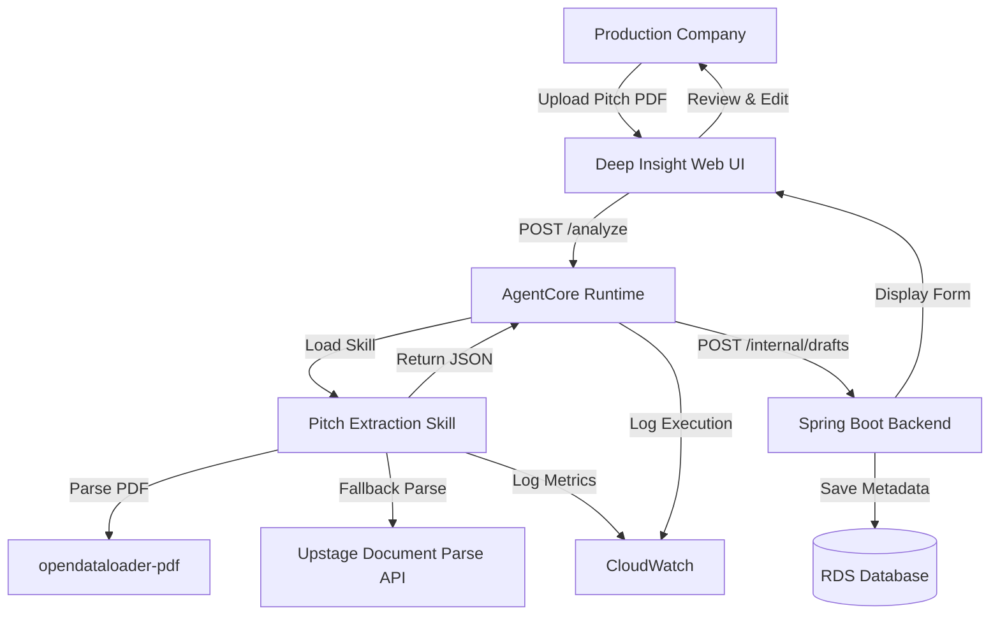

# Design Document: Pitch Extraction Automation

## Overview

The pitch extraction automation feature provides automated metadata extraction from Korean pitch PDFs for the ShortFlow content registration system. The system implements a two-stage parsing strategy to balance cost efficiency with extraction reliability, using opendataloader-pdf as the primary parser and Upstage Document Parse API as a fallback for complex or image-heavy documents.

### Design Goals

1. **Cost Efficiency**: Minimize Upstage API credit consumption through intelligent fallback detection
2. **Extraction Reliability**: Achieve high-quality metadata extraction across diverse PDF formats
3. **Korean Language Support**: Preserve Korean text integrity throughout the extraction pipeline
4. **Graceful Degradation**: Return partial results when complete extraction is not possible
5. **Integration Simplicity**: Provide clean JSON output for Spring Boot backend consumption

### Key Design Decisions

**Two-Stage Parsing Strategy**: The system uses opendataloader-pdf for initial parsing attempts because it's free and handles standard text-based PDFs well. Upstage Document Parse API is reserved for fallback scenarios where OCR or advanced layout analysis is needed, minimizing billable API calls.

**Confidence-Based Validation**: Each extracted field includes a confidence level (high/medium/low/inferred) to enable intelligent human review prioritization. This acknowledges that automated extraction cannot achieve 100% accuracy and provides transparency about extraction quality.

**Skill System Integration**: The feature is implemented as a lazy-loaded skill in the Deep Insight platform, following the Claude Code skill system pattern. This keeps the base system prompt compact while providing detailed extraction instructions on-demand.

**Stateless Extraction**: The extraction process is stateless and idempotent. Each PDF parsing request is independent, simplifying error recovery and enabling horizontal scaling.

## Architecture

### System Context



### Component Architecture

The system consists of five primary components:

1. **PDF_Parser**: Orchestrates the two-stage parsing strategy
2. **Fallback_Detector**: Evaluates extraction quality and triggers fallback
3. **Field_Extractor**: Identifies and extracts 9 metadata fields from parsed text
4. **Metadata_Validator**: Assigns confidence levels to extracted fields
5. **Pitch_Extractor**: Coordinates the extraction pipeline and formats output

```mermaid
graph LR
    INPUT[Pitch PDF] --> PP[PDF_Parser]
    PP -->|Stage 1| OPD[opendataloader-pdf]
    OPD -->|Extracted Text| FD[Fallback_Detector]
    FD -->|Quality Check| DECISION{Pass?}
    DECISION -->|Yes| FE[Field_Extractor]
    DECISION -->|No| UPSTAGE[Upstage DP API]
    UPSTAGE -->|Extracted Text| FE
    FE -->|Raw Fields| MV[Metadata_Validator]
    MV -->|Fields + Confidence| PE[Pitch_Extractor]
    PE -->|JSON Output| OUTPUT[Spring Boot Backend]
```



### Deployment Architecture

**Local Development**:
- AgentCore Runtime runs in Docker container
- Skills loaded from `./skills/pitch-extraction/SKILL.md`
- Upstage API key from environment variable `UPSTAGE_API_KEY`

**AWS Production**:
- AgentCore Runtime on ECS Fargate
- Skills bundled in Docker image
- Upstage API key from AWS Secrets Manager
- CloudWatch Logs for observability
- ALB for load balancing and health checks

## Components and Interfaces

### PDF_Parser Component

**Responsibility**: Convert PDF files to text using a two-stage parsing strategy.

**Interface**:
```python
class PDFParser:
    def parse(self, pdf_path: str) -> ParseResult:
        """
        Parse PDF using two-stage strategy.
        
        Args:
            pdf_path: Absolute path to PDF file
            
        Returns:
            ParseResult with text, method, and success status
        """
        pass
```

**Data Structures**:
```python
@dataclass
class ParseResult:
    success: bool
    text: str
    method: str  # "opendataloader" or "upstage_dp"
    error: Optional[str] = None
    page_count: int = 0
```

**Implementation Strategy**:
- Stage 1: Use opendataloader-pdf library (`load_pdf()` function)
- Stage 2: Call Upstage Document Parse API with base64-encoded PDF
- Return parsing method in result for cost tracking

### Fallback_Detector Component

**Responsibility**: Evaluate extraction quality and determine if fallback is needed.

**Interface**:
```python
class FallbackDetector:
    def should_fallback(self, text: str, page_count: int) -> bool:
        """
        Determine if Upstage fallback is needed.
        
        Args:
            text: Extracted text from opendataloader-pdf
            page_count: Number of pages in PDF
            
        Returns:
            True if fallback is needed, False otherwise
        """
        pass
```

**Quality Thresholds**:
- Minimum text length: 100 characters
- Minimum Korean character ratio: 10%
- Minimum characters per page: 50

**Implementation Strategy**:
```python
def should_fallback(text: str, page_count: int) -> bool:
    # Threshold 1: Minimum text length
    if len(text) < 100:
        return True
    
    # Threshold 2: Korean character ratio
    korean_chars = sum(1 for c in text if '\uAC00' <= c <= '\uD7A3')
    if len(text) > 0 and korean_chars / len(text) < 0.1:
        return True
    
    # Threshold 3: Characters per page
    if page_count > 0 and len(text) / page_count < 50:
        return True
    
    return False
```

### Field_Extractor Component

**Responsibility**: Extract 9 metadata fields from parsed text using pattern matching and label detection.

**Interface**:
```python
class FieldExtractor:
    def extract_fields(self, text: str) -> Dict[str, Any]:
        """
        Extract all 9 metadata fields from text.
        
        Args:
            text: Parsed text from PDF
            
        Returns:
            Dictionary with field names as keys and extracted values
        """
        pass
```

**Extraction Patterns**:

| Field | Pattern | Example |
|-------|---------|---------|
| title | `r'(?:제목|작품명|Title):\s*(.+)'` | "제목: 달빛 로맨스" |
| logline | `r'(?:로그라인|한줄 소개):\s*(.+)'` | "로그라인: 달빛 아래 펼쳐지는 사랑 이야기" |
| synopsis | `r'(?:시놉시스|줄거리|스토리):\s*(.+?)(?=\n\n|\Z)'` | Multi-paragraph text |
| characterDescription | `r'(?:등장인물|캐릭터|인물 소개):\s*(.+?)(?=\n\n|\Z)'` | Multi-line character list |
| episodes | `r'(?:총\s*)?(\d+)(?:화|부작|회)'` | "총 30화" → 30 |
| runtime | `r'(?:회당|편당|러닝타임)\s*(\d+)\s*분'` | "회당 3분" → 3 |
| genre | `r'(?:장르|Genre):\s*(.+)'` | "로맨스/코미디" → ["로맨스", "코미디"] |
| productionYear | `r'(202[0-9]|203[0])'` | "2025" → 2025 |
| productionStatus | `r'(기획중|제작중|완성|완료|방영완료)'` | "제작중" → "제작중" |

**Inference Rules**:
- If logline is not found, generate from synopsis first sentence (max 40 characters)
- If productionStatus is "완료" or "방영완료", normalize to "완성"
- If genre contains "/" or ",", split into array
- If field cannot be extracted, return null

### Metadata_Validator Component

**Responsibility**: Assign confidence levels to extracted fields based on extraction method.

**Interface**:
```python
class MetadataValidator:
    def validate(self, fields: Dict[str, Any], extraction_metadata: Dict) -> Dict[str, str]:
        """
        Assign confidence levels to extracted fields.
        
        Args:
            fields: Extracted field values
            extraction_metadata: Metadata about how each field was extracted
            
        Returns:
            Dictionary mapping field names to confidence levels
        """
        pass
```

**Confidence Level Rules**:
- **high**: Field extracted using explicit label matching (e.g., "제목: 달빛 로맨스")
- **medium**: Field extracted using pattern matching without explicit label (e.g., "30화" without "총" prefix)
- **low**: Field extracted through uncertain matching or inference from context
- **inferred**: Field generated from other fields (e.g., logline from synopsis)

**Implementation Strategy**:
```python
def assign_confidence(field_name: str, extraction_method: str) -> str:
    if extraction_method == "label_match":
        return "high"
    elif extraction_method == "pattern_match":
        return "medium"
    elif extraction_method == "inferred":
        return "inferred"
    else:
        return "low"
```

### Pitch_Extractor Component

**Responsibility**: Orchestrate the extraction pipeline and format JSON output.

**Interface**:
```python
class PitchExtractor:
    def extract(self, pdf_path: str) -> ExtractionResult:
        """
        Execute full extraction pipeline.
        
        Args:
            pdf_path: Absolute path to PDF file
            
        Returns:
            ExtractionResult with fields, confidence, and metadata
        """
        pass
```

**Pipeline Flow**:
1. Parse PDF using PDF_Parser
2. If parsing fails, trigger fallback
3. Extract fields using Field_Extractor
4. Validate fields using Metadata_Validator
5. Format output as JSON
6. Log metrics to CloudWatch

### Skill System Integration

**skill_tool Interface**:
```python
def skill_tool(skill_name: str) -> str:
    """
    Load skill instructions into context.
    
    Args:
        skill_name: Name of skill to load (e.g., "pitch-extraction")
        
    Returns:
        Full skill instructions as markdown text
    """
    pass
```

**Skill Metadata** (SKILL.md frontmatter):
```yaml
---
name: pitch-extraction
description: >
  ShortFlow 기획안 PDF에서 콘텐츠 메타데이터를 자동 추출하는 스킬.
  반드시 사용해야 하는 상황: 제작사가 기획안 PDF를 업로드하고 메타데이터 추출을 요청할 때
license: MIT
allowed-tools:
  - bash_tool
  - file_read
  - file_write
---
```

**Discovery Integration**:
- SkillDiscovery scans `./skills/pitch-extraction/SKILL.md` at startup
- Extracts name and description from frontmatter
- Adds to available_skills dictionary
- Skill content loaded lazily when skill_tool is invoked

## Data Models

### ExtractionResult Model

```python
@dataclass
class ExtractionResult:
    extracted_at: str  # ISO 8601 timestamp
    parsing_method: str  # "opendataloader" or "upstage_dp"
    fields: FieldSet
    confidence: Dict[str, str]
    missing_fields: List[str]
```

### FieldSet Model

```python
@dataclass
class FieldSet:
    title: Optional[str] = None
    logline: Optional[str] = None
    synopsis: Optional[str] = None
    character_description: Optional[str] = None
    episodes: Optional[int] = None
    runtime: Optional[int] = None
    genre: Optional[List[str]] = None
    production_year: Optional[int] = None
    production_status: Optional[str] = None
```

### JSON Output Format

```json
{
  "extractedAt": "2026-04-09T10:00:00Z",
  "parsingMethod": "opendataloader",
  "fields": {
    "title": "달빛 로맨스",
    "logline": "달빛 아래 펼쳐지는 사랑 이야기",
    "synopsis": "주인공 지우는 달빛이 비치는 밤마다 신비한 남자를 만난다...",
    "characterDescription": "지우: 25세 여성, 출판사 편집자\n민준: 28세 남성, 사진작가",
    "episodes": 30,
    "runtime": 3,
    "genre": ["로맨스", "판타지"],
    "productionYear": 2025,
    "productionStatus": "제작중"
  },
  "confidence": {
    "title": "high",
    "logline": "high",
    "synopsis": "high",
    "characterDescription": "high",
    "episodes": "high",
    "runtime": "medium",
    "genre": "high",
    "productionYear": "low",
    "productionStatus": "medium"
  },
  "missingFields": []
}
```

### Database Schema (RDS)

**drafts table**:
```sql
CREATE TABLE drafts (
    id BIGINT PRIMARY KEY AUTO_INCREMENT,
    production_company_id BIGINT NOT NULL,
    title VARCHAR(255),
    logline VARCHAR(255),
    synopsis TEXT,
    character_description TEXT,
    episodes INT,
    runtime INT,
    genre JSON,  -- Array of strings
    production_year INT,
    production_status VARCHAR(50),
    confidence JSON,  -- Map of field -> confidence level
    missing_fields JSON,  -- Array of field names
    parsing_method VARCHAR(50),
    extracted_at TIMESTAMP,
    created_at TIMESTAMP DEFAULT CURRENT_TIMESTAMP,
    updated_at TIMESTAMP DEFAULT CURRENT_TIMESTAMP ON UPDATE CURRENT_TIMESTAMP,
    FOREIGN KEY (production_company_id) REFERENCES production_companies(id)
);
```

## Error Handling

### Error Categories

1. **Parsing Errors**: PDF cannot be parsed by either opendataloader-pdf or Upstage API
2. **Extraction Errors**: Text is parsed but fields cannot be extracted
3. **API Errors**: Upstage API returns error response
4. **Validation Errors**: Extracted fields fail validation rules

### Error Handling Strategy

**Parsing Errors**:
```python
try:
    result = load_pdf(pdf_path)
except Exception as e:
    logger.error(f"opendataloader-pdf failed: {e}")
    # Trigger Upstage fallback
    result = upstage_parse(pdf_path)
```

**Extraction Errors**:
```python
# Continue processing even if individual fields fail
for field_name in REQUIRED_FIELDS:
    try:
        value = extract_field(text, field_name)
        fields[field_name] = value
    except Exception as e:
        logger.warning(f"Failed to extract {field_name}: {e}")
        fields[field_name] = None
        missing_fields.append(field_name)
```

**API Errors**:
```python
response = requests.post(UPSTAGE_API_URL, ...)
if response.status_code != 200:
    logger.error(f"Upstage API error: {response.status_code} {response.text}")
    return ExtractionResult(
        success=False,
        error=f"Upstage API error: {response.status_code}"
    )
```

**Graceful Degradation**:
- Return partial results when some fields are extracted successfully
- Include missing_fields array to indicate incomplete extraction
- Assign "low" confidence to uncertain extractions
- Log all errors to CloudWatch for monitoring

### CloudWatch Logging

**Log Groups**:
- `/aws/ecs/agentcore-runtime`: AgentCore execution logs
- `/aws/ecs/pitch-extraction`: Pitch extraction specific logs

**Log Events**:
```python
logger.info("Parsing PDF", extra={
    "pdf_path": pdf_path,
    "method": "opendataloader"
})

logger.warning("Fallback triggered", extra={
    "reason": "low_korean_ratio",
    "korean_ratio": 0.05,
    "threshold": 0.10
})

logger.error("Extraction failed", extra={
    "field": "episodes",
    "error": str(e)
})

logger.info("Extraction complete", extra={
    "parsing_method": "upstage_dp",
    "extracted_fields": 8,
    "missing_fields": ["productionYear"],
    "latency_ms": 2500
})
```

## Correctness Properties

*A property is a characteristic or behavior that should hold true across all valid executions of a system—essentially, a formal statement about what the system should do. Properties serve as the bridge between human-readable specifications and machine-verifiable correctness guarantees.*

### Property 1: Fallback Detection Thresholds

*For any* extracted text and page count, the Fallback_Detector SHALL trigger Upstage fallback if and only if at least one of these conditions is met: text length < 100 characters, Korean character ratio < 10%, or average characters per page < 50.

**Validates: Requirements 1.3, 1.4, 1.5, 7.2**

### Property 2: Field Extraction from Labeled Sections

*For any* text containing a field label (e.g., "제목:", "로그라인:", "시놉시스:", "등장인물:", "장르:"), the Field_Extractor SHALL extract the content following that label as the corresponding field value.

**Validates: Requirements 2.1, 2.2, 2.4, 2.5, 2.8, 2.10, 5.2**

### Property 3: Numeric Field Extraction and Type Conversion

*For any* text containing numeric patterns ("총 N화", "N부작", "N회", "회당 N분", "편당 N분"), the Field_Extractor SHALL extract the numeric value and return it as an integer.

**Validates: Requirements 2.6, 2.7**

### Property 4: Logline Inference from Synopsis

*For any* text containing a synopsis but no explicit logline, the Field_Extractor SHALL generate a logline from the synopsis first sentence (max 40 characters) and assign "inferred" confidence.

**Validates: Requirements 2.3**

### Property 5: ProductionStatus Normalization

*For any* extracted productionStatus value matching "완료" or "방영완료", the Field_Extractor SHALL normalize it to "완성".

**Validates: Requirements 2.11**

### Property 6: Null Handling for Missing Fields

*For any* text missing a specific field, the Field_Extractor SHALL return null for that field, continue processing other fields, and include the field name in the missingFields array.

**Validates: Requirements 2.12, 6.3**

### Property 7: Confidence Level Assignment

*For any* extracted field, the Metadata_Validator SHALL assign confidence levels according to extraction method: "high" for explicit label matching, "medium" for pattern matching, "low" for uncertain matching, and "inferred" for generated fields. All 9 fields SHALL have confidence levels in the response.

**Validates: Requirements 3.1, 3.2, 3.3, 3.4, 3.5**

### Property 8: JSON Output Completeness

*For any* extraction result, the Pitch_Extractor SHALL return a JSON object containing: extractedAt timestamp in ISO 8601 format, parsingMethod field, fields object with all 9 metadata fields, confidence object with all 9 confidence levels, and missingFields array.

**Validates: Requirements 4.1, 4.2, 4.3, 4.4, 4.5**

### Property 9: Korean Text Preservation

*For any* Korean text extracted from a PDF, the Pitch_Extractor SHALL preserve the original Korean characters (UTF-8 encoding, Unicode range U+AC00 to U+D7A3) including formatting, line breaks, and punctuation without translation or corruption.

**Validates: Requirements 4.6, 5.1, 5.3**

### Property 10: Korean Character Ratio Calculation

*For any* text, the Fallback_Detector SHALL calculate the Korean character ratio by counting characters in Unicode range U+AC00 to U+D7A3 divided by total text length.

**Validates: Requirements 5.4**

### Property 11: Genre Splitting

*For any* genre field containing delimiters ("/" or ","), the Field_Extractor SHALL split the genre string into an array of individual genre values.

**Validates: Requirements 2.8**

### Property 12: Year Range Validation

*For any* text containing 4-digit year patterns, the Field_Extractor SHALL extract only years in the range 2020-2030 as the productionYear field.

**Validates: Requirements 2.9**

## Testing Strategy

The testing strategy employs a dual approach combining unit tests for specific scenarios and property-based tests for universal correctness properties.

### Property-Based Testing

Property-based tests validate universal properties across randomized inputs. Each property test runs a minimum of 100 iterations to ensure comprehensive coverage.

**PBT Library**: Use `hypothesis` for Python implementation

**Property Test Configuration**:
```python
from hypothesis import given, strategies as st
import pytest

# Minimum 100 iterations per property test
@pytest.mark.property
@given(text=st.text(min_size=0, max_size=500))
def test_property_X(text):
    # Test implementation
    pass
```

**Property Test Tags**: Each property test must reference its design document property:
```python
@pytest.mark.property
@pytest.mark.feature("pitch-extraction-automation")
@pytest.mark.validates("Property 1: Fallback Detection Thresholds")
```

**Property Test Implementations**:

1. **Property 1: Fallback Detection Thresholds**
   - Generate random texts with varying lengths (0-200 chars)
   - Generate random Korean/non-Korean character mixes (0-100% Korean)
   - Generate random page counts (1-20 pages)
   - Verify fallback triggers correctly for each threshold

2. **Property 2: Field Extraction from Labeled Sections**
   - Generate random texts with field labels at various positions
   - Generate random content after labels
   - Verify extraction works regardless of surrounding text

3. **Property 3: Numeric Field Extraction**
   - Generate random texts with numeric patterns
   - Generate random numbers (1-999)
   - Verify integer conversion is correct

4. **Property 4: Logline Inference**
   - Generate random synopsis texts
   - Verify logline is generated when missing
   - Verify "inferred" confidence is assigned

5. **Property 5: ProductionStatus Normalization**
   - Generate random status keywords
   - Verify normalization to "완성"

6. **Property 6: Null Handling**
   - Generate random texts missing various fields
   - Verify null is returned and missingFields is populated

7. **Property 7: Confidence Level Assignment**
   - Generate random extraction results with different methods
   - Verify confidence levels match extraction method

8. **Property 8: JSON Output Completeness**
   - Generate random extraction results
   - Verify all required JSON fields are present
   - Verify ISO 8601 timestamp format

9. **Property 9: Korean Text Preservation**
   - Generate random Korean texts (Unicode U+AC00 to U+D7A3)
   - Extract and verify text matches original (round-trip property)

10. **Property 10: Korean Character Ratio**
    - Generate random texts with known Korean character counts
    - Verify ratio calculation is correct

11. **Property 11: Genre Splitting**
    - Generate random genre strings with "/" and "," delimiters
    - Verify splitting produces correct array

12. **Property 12: Year Range Validation**
    - Generate random texts with years inside and outside 2020-2030
    - Verify only valid years are extracted

### Unit Testing

Unit tests focus on specific examples, edge cases, and integration points.

**PDF_Parser Tests**:
- Test opendataloader-pdf with standard text-based PDF
- Test Upstage API with image-heavy PDF
- Test error handling for corrupted PDF
- Test parsing method tracking

**Fallback_Detector Tests**:
- Test threshold detection for text length < 100
- Test threshold detection for Korean ratio < 10%
- Test threshold detection for chars/page < 50
- Test Korean character counting (U+AC00 to U+D7A3)

**Field_Extractor Tests**:
- Test title extraction with "제목:" label
- Test logline extraction with "로그라인:" label
- Test logline inference from synopsis
- Test synopsis extraction with multi-paragraph text
- Test characterDescription extraction
- Test episodes extraction with "총 30화" pattern
- Test runtime extraction with "회당 3분" pattern
- Test genre splitting for "로맨스/코미디"
- Test productionYear extraction with 4-digit year
- Test productionStatus normalization ("완료" → "완성")
- Test null handling for missing fields

**Metadata_Validator Tests**:
- Test "high" confidence for label-matched fields
- Test "medium" confidence for pattern-matched fields
- Test "low" confidence for uncertain extractions
- Test "inferred" confidence for generated fields

**Pitch_Extractor Tests**:
- Test full pipeline with sample PDF
- Test JSON output format
- Test missing_fields array population
- Test timestamp generation (ISO 8601)

### Integration Testing

**End-to-End Tests**:
- Upload sample pitch PDF through Deep Insight Web UI
- Verify extraction completes within 10 seconds
- Verify JSON is saved to RDS drafts table
- Verify confidence levels are displayed in UI
- Verify human review workflow

**Upstage API Integration**:
- Test fallback trigger with image-only PDF
- Test OCR capability with scanned document
- Test API error handling (rate limit, invalid key)
- Test credit consumption tracking

**Spring Boot Integration**:
- Test POST /internal/drafts endpoint
- Test RDS save operation
- Test JSON field mapping
- Test error response handling

### Test Data

**Sample PDFs**:
1. `standard-pitch.pdf`: Text-based PDF with all 9 fields
2. `image-heavy-pitch.pdf`: Scanned PDF requiring OCR
3. `partial-pitch.pdf`: PDF missing some fields (e.g., no productionYear)
4. `corrupted-pitch.pdf`: Invalid PDF file for error testing

**Expected Outputs**:
- `standard-pitch-expected.json`: Full extraction with high confidence
- `image-heavy-pitch-expected.json`: Full extraction with medium confidence
- `partial-pitch-expected.json`: Partial extraction with missing_fields array

### Performance Testing

**Latency Targets**:
- opendataloader-pdf parsing: < 2 seconds
- Upstage API parsing: < 5 seconds
- Field extraction: < 1 second
- Total end-to-end: < 10 seconds

**Load Testing**:
- Simulate 10 concurrent PDF uploads
- Verify no extraction failures
- Verify CloudWatch metrics are logged
- Verify Upstage API rate limits are respected

## Deployment Considerations

### Local Development

**Docker Compose Setup**:
```yaml
version: '3.8'
services:
  agentcore:
    build: ./self-hosted
    environment:
      - UPSTAGE_API_KEY=${UPSTAGE_API_KEY}
    volumes:
      - ./self-hosted/skills:/app/skills
    ports:
      - "8000:8000"
```

**Environment Variables**:
```bash
UPSTAGE_API_KEY=your_api_key_here
SKILL_DIRS=./skills
LOG_LEVEL=INFO
```

### AWS Production

**ECS Task Definition**:
```json
{
  "family": "agentcore-runtime",
  "containerDefinitions": [{
    "name": "agentcore",
    "image": "your-ecr-repo/agentcore:latest",
    "environment": [
      {"name": "SKILL_DIRS", "value": "/app/skills"}
    ],
    "secrets": [
      {"name": "UPSTAGE_API_KEY", "valueFrom": "arn:aws:secretsmanager:..."}
    ],
    "logConfiguration": {
      "logDriver": "awslogs",
      "options": {
        "awslogs-group": "/aws/ecs/agentcore-runtime",
        "awslogs-region": "us-east-1",
        "awslogs-stream-prefix": "ecs"
      }
    }
  }]
}
```

**CloudWatch Metrics**:
- `PitchExtraction.ParseLatency`: Histogram of parsing latency
- `PitchExtraction.ExtractionSuccess`: Count of successful extractions
- `PitchExtraction.FallbackRate`: Percentage of requests using Upstage fallback
- `PitchExtraction.UpstageCredits`: Count of Upstage API calls

**Secrets Manager**:
- Store Upstage API key in AWS Secrets Manager
- Rotate key every 90 days
- Use IAM role for ECS task to access secret

### Monitoring and Alerting

**CloudWatch Alarms**:
- Alert if extraction success rate < 90%
- Alert if Upstage fallback rate > 50%
- Alert if average latency > 15 seconds
- Alert if error rate > 5%

**Dashboard Metrics**:
- Extraction requests per hour
- Success rate by parsing method
- Average confidence levels by field
- Missing fields frequency distribution

