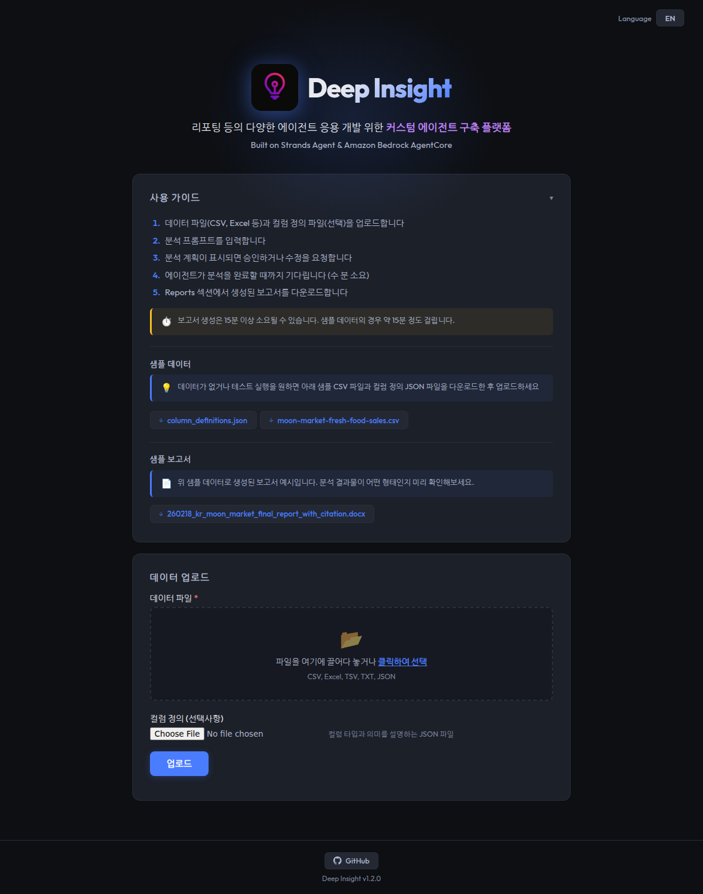

# Deep Insight: Web UI

> Browser-based interface for data upload, analysis, HITL plan review, and report download

**Last Updated**: 2026-02

---

## Overview

Web UI for Deep Insight — a FastAPI server that connects to the Managed AgentCore backend and provides a browser-based experience for non-technical users. For the complete project overview and deployment comparison, see the [root README](../README.md).

- **Browser-Based**: Upload data, review plans, download reports — no CLI needed
- **Bilingual**: Korean / English language support
- **Secure**: Internet-facing ALB restricted to VPN CIDR



---

## Quick Start

### Prerequisites

| Requirement | Details | Check Command |
|-------------|---------|---------------|
| Managed AgentCore | Phase 1–3 deployed ([guide](../managed-agentcore/README.md)) | `cat ../managed-agentcore/.env` |
| Docker | 20.x+ | `docker --version` |

> **Important**: The Web UI requires a running Managed AgentCore deployment. The `managed-agentcore/.env` file must exist with `RUNTIME_ARN`, `AWS_REGION`, and `S3_BUCKET_NAME` configured.

### Production Deployment

```bash
cd deep-insight-web

# Deploy (ECR, Docker build/push, ALB, ECS)
# VPN_CIDR restricts ALB access to your VPN's IP range (only users on the VPN can reach the Web UI)
# Usage: bash deploy.sh <VPN_CIDR>
# Example: bash deploy.sh "10.0.0.0/8"
bash deploy.sh "<YOUR_VPN_CIDR>"

# Wait for service to stabilize
aws ecs wait services-stable \
  --cluster deep-insight-cluster-prod \
  --services deep-insight-web-service \
  --region us-west-2

# Clean up all resources
bash deploy.sh cleanup
```

> **Note**: Do NOT test during rolling deployment — the old ECS task gets killed mid-stream.

---

## Features

| Feature | Endpoint | Description |
|---------|----------|-------------|
| Health check | `GET /health` | ALB health check (status, runtime ARN, region, S3 bucket) |
| Static page | `GET /` | Serves `static/index.html` |
| File upload | `POST /upload` | Upload data file + optional column definitions to S3 |
| Analysis | `POST /analyze` | Invoke AgentCore Runtime, stream SSE events to browser |
| HITL review | `POST /feedback` | Submit plan approval/rejection (uploaded to S3) |
| Artifacts | `GET /artifacts/{session_id}` | List generated report files |
| Download | `GET /download/{session_id}/{filename}` | Download a report file |

> For detailed feature specifications, see the [Development Plan](../docs/front-end/03-development-plan.md).

---

## Architecture

```
Browser ←─ SSE ──→ FastAPI (deep-insight-web)
                        │
                        ├── boto3.invoke_agent_runtime() ──→ AgentCore Runtime
                        │        (SSE streaming, 3600s timeout)
                        │
                        └── S3 ──→ File upload / HITL feedback / Report download
```

- **AgentCore Native Protocol**: `boto3.invoke_agent_runtime()` with SSE streaming
- **HITL flow**: `plan_review_request` SSE event → browser modal → `POST /feedback` → S3 → AgentCore polls
- **Env vars**: Reuses `managed-agentcore/.env` (no separate `.env.example`)
