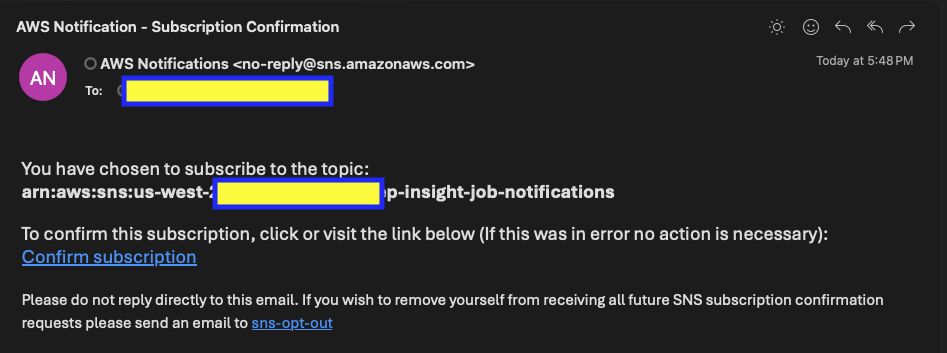
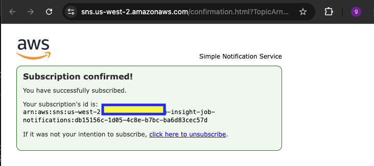
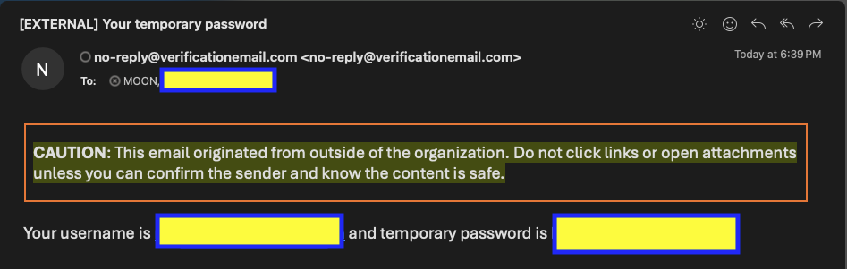
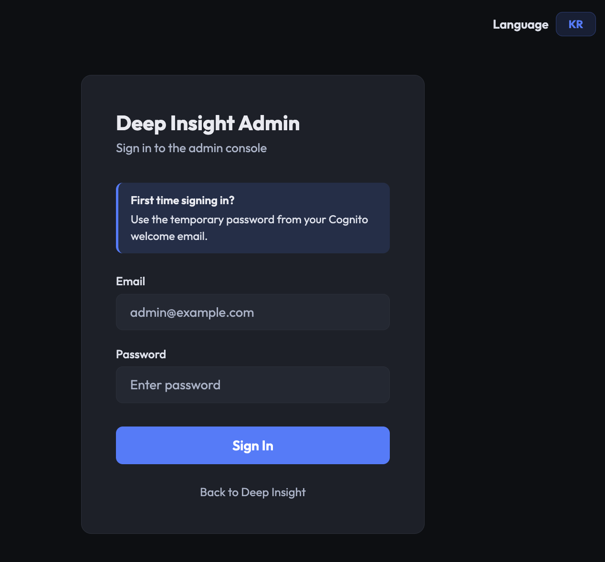
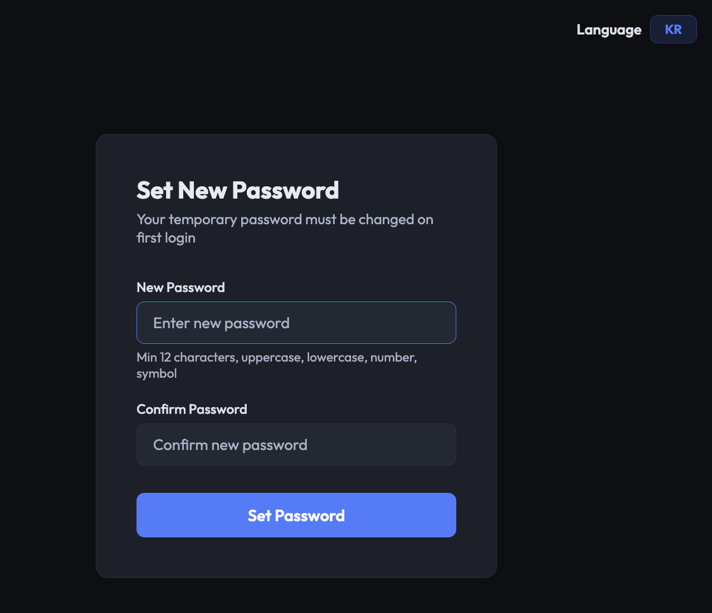
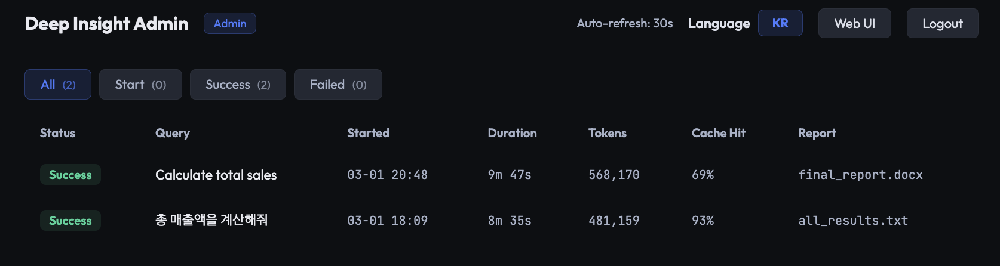
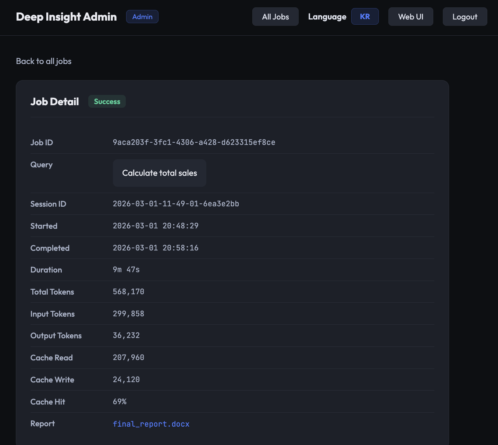
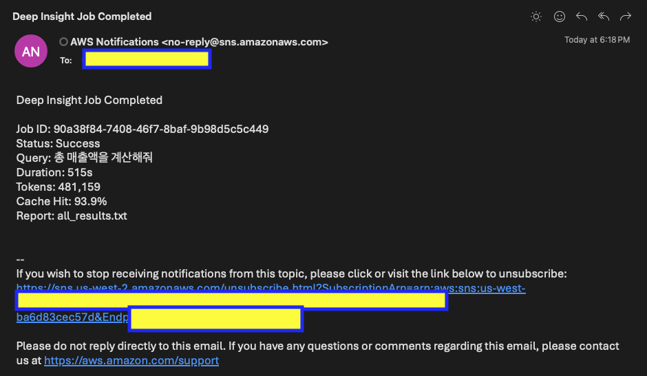

# Deep Insight Ops — Deployment Guide

> Job tracking, email notifications, and admin dashboard for Deep Insight Web.

**Last Updated**: 2026-03

---

## Overview

Deep Insight Ops adds operational monitoring to the Web UI:

- **Job Tracking** — DynamoDB records every analysis job (status, tokens, duration)
- **Email Notifications** — SNS sends completion/failure emails to admins
- **Admin Dashboard** — Web-based dashboard with Cognito authentication

All Ops resources are optional — the Web UI works normally without them.

**References**:
- [Planning Documents](../../docs/ops/plan/) — business requirements, research, technical approach, implementation plan
- [Admin Authentication](../../docs/ops/admin-authentication.md) — Cognito JWT auth flow, cookie security, route protection
- [Language Switching](../../docs/ops/language-switching.md) — Korean/English i18n for admin dashboard pages

---

## Prerequisites

| Requirement | Details | Check |
|-------------|---------|-------|
| Managed AgentCore | Phase 1-3 deployed | `cat ../managed-agentcore/.env` |
| Deep Insight Web | `deploy.sh` already run | ALB DNS responds to `/health` |
| AWS CLI | Configured with admin permissions | `aws sts get-caller-identity` |

---

## Deploy

### Step 1: Deploy Ops infrastructure

```bash
cd deep-insight-web

# Provide admin email(s) for SNS notifications and Cognito accounts
bash ops/deploy_ops.sh admin1@example.com admin2@example.com
```

This creates:

| Resource | Name |
|----------|------|
| DynamoDB Table | `deep-insight-jobs` (PAY_PER_REQUEST, 2 GSIs) |
| SNS Topic | `deep-insight-job-notifications` |
| SNS Subscriptions | One per admin email |
| Lambda IAM Role | `deep-insight-ops-lambda-role` |
| Lambda Function | `deep-insight-job-complete` (Python 3.12) |
| S3 Event Notification | `token_usage.json` upload triggers Lambda |
| Cognito User Pool | `deep-insight-ops-admins` (no self-signup, min 12 char password) |
| Cognito App Client | `deep-insight-ops-web` (no client secret) |
| Cognito Admin Users | One per admin email (temporary password sent via email) |
| Web Task Role Policy | DynamoDB + SNS permissions added |
| ECS Task Definition | `DYNAMODB_TABLE_NAME`, `SNS_TOPIC_ARN`, `COGNITO_USER_POOL_ID`, `COGNITO_CLIENT_ID` env vars added |

### Step 2: Redeploy Web UI

```bash
# Rebuilds Docker image (includes ops/ module) and updates ECS service
bash deploy.sh
```

> `deploy.sh` preserves env vars added by `deploy_ops.sh`.

### Step 3: Wait for ECS service stability

```bash
aws ecs wait services-stable \
  --cluster deep-insight-cluster-prod \
  --services deep-insight-web-service \
  --region us-west-2
```

### Step 4: Verify

```bash
# Check DynamoDB table exists
aws dynamodb describe-table --table-name deep-insight-jobs \
  --region us-west-2 --query "Table.TableStatus"

# Check Lambda function exists
aws lambda get-function --function-name deep-insight-job-complete \
  --region us-west-2 --query "Configuration.FunctionArn"

# Check S3 event notification
aws s3api get-bucket-notification-configuration \
  --bucket <YOUR_BUCKET> --region us-west-2 \
  --query "LambdaFunctionConfigurations[?Id=='deep-insight-job-complete']"

# Check ECS task definition has Ops env vars
aws ecs describe-task-definition --task-definition deep-insight-web-task \
  --region us-west-2 \
  --query "taskDefinition.containerDefinitions[0].environment[?name=='DYNAMODB_TABLE_NAME']"
```

---

## Getting Started

### Confirm SNS Subscription

Each admin receives a confirmation email from AWS. **Click the link** to activate notifications.



After clicking, you should see the confirmation page:



### Admin Login

Each admin also receives a Cognito email with a temporary password.



Navigate to `https://<ALB_DNS>/admin/login` and enter your email and temporary password.



On first login, you are prompted to set a new permanent password (minimum 12 characters).



### Dashboard Walkthrough

After login, the dashboard shows all analysis jobs with status, duration, tokens, and cache hit rate. Auto-refreshes every 30 seconds.



Click any job row to view full details including token breakdown and report download link.



---

## Test

Run an analysis job from the Web UI to verify the full pipeline:

1. **Submit** an analysis query via the Web UI
2. **Check dashboard** — job appears with status `Start`
3. **Wait for completion** — status changes to `Success`, token stats populate
4. **Check email** — admins receive a completion notification



```bash
# Or verify via CLI
aws dynamodb scan --table-name deep-insight-jobs \
  --region us-west-2 --query "Items[].{job_id:job_id.S,status:status.S}" \
  --output table
```

---

## Maintenance

### Redeploy

```bash
cd deep-insight-web

# Update Lambda code only (no email args = skip subscription/user creation)
bash ops/deploy_ops.sh

# Redeploy Web UI (preserves Ops env vars)
bash deploy.sh
```

### Add Subscribers

```bash
# New subscriber receives a confirmation email
aws sns subscribe \
  --topic-arn arn:aws:sns:us-west-2:<ACCOUNT_ID>:deep-insight-job-notifications \
  --protocol email \
  --endpoint new-admin@example.com

# List current subscribers
aws sns list-subscriptions-by-topic \
  --topic-arn arn:aws:sns:us-west-2:<ACCOUNT_ID>:deep-insight-job-notifications \
  --query "Subscriptions[].{Endpoint:Endpoint,Status:SubscriptionArn}" \
  --output table
```

### Add Admin Users

```bash
# Create a new Cognito admin (temporary password sent via email)
aws cognito-idp admin-create-user \
  --user-pool-id <USER_POOL_ID> \
  --username new-admin@example.com \
  --user-attributes Name=email,Value=new-admin@example.com Name=email_verified,Value=true \
  --region us-west-2
```

---

## Cleanup

```bash
cd deep-insight-web

# Remove all Ops resources (DynamoDB, SNS, Lambda, IAM, S3 event, Cognito)
bash ops/deploy_ops.sh cleanup
```

> ECS task definition env vars (DYNAMODB_TABLE_NAME, SNS_TOPIC_ARN) remain but are harmless — `job_tracker.py` skips writes when the table does not exist.

---

## Troubleshooting

### Lambda not triggering

```bash
# Check S3 event notification exists
aws s3api get-bucket-notification-configuration \
  --bucket <YOUR_BUCKET> --region us-west-2

# Check Lambda logs
aws logs tail /aws/lambda/deep-insight-job-complete --region us-west-2 --since 1h
```

### DynamoDB record stuck in "Start"

The Lambda triggers on `token_usage.json` upload. If the analysis completed but no Success record:

```bash
# Check if token_usage.json was uploaded
aws s3 ls s3://<YOUR_BUCKET>/deep-insight/fargate_sessions/<SESSION_ID>/output/

# Check if session_id was linked to job record
aws dynamodb query --table-name deep-insight-jobs \
  --index-name SessionIdIndex \
  --key-condition-expression "session_id = :sid" \
  --expression-attribute-values '{":sid":{"S":"<SESSION_ID>"}}' \
  --region us-west-2
```

### No email notifications

1. Check SNS subscription is confirmed (not `PendingConfirmation`)
2. Check spam/junk folder
3. Verify Lambda has SNS publish permission

```bash
aws sns list-subscriptions-by-topic \
  --topic-arn arn:aws:sns:us-west-2:<ACCOUNT_ID>:deep-insight-job-notifications \
  --query "Subscriptions[].{Endpoint:Endpoint,Arn:SubscriptionArn}" \
  --output table
```

### Login returns "Auth service unavailable"

Check ECS container logs for Cognito/JWT errors:

```bash
aws logs tail /ecs/deep-insight-web --region us-west-2 --since 15m
```

Common causes:
- `COGNITO_USER_POOL_ID` or `COGNITO_CLIENT_ID` env vars missing — rerun `deploy.sh`
- `cryptography` package not installed — check `requirements.txt`
